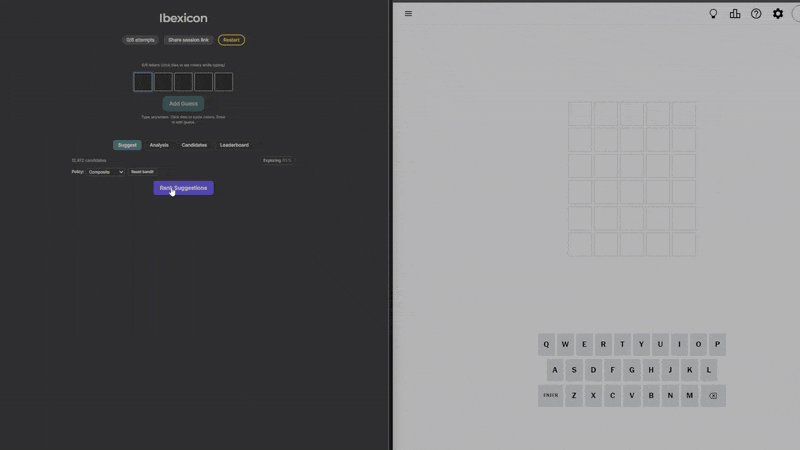

# Ibexicon — a smart Wordle assistant

**Live demo:** https://tylerflar.github.io/ibexicon/

Ibexicon helps you solve external Wordle-style games. You enter your guesses and color feedback; Ibexicon computes the best next guess using a balance of **exploration** (information gain) and **exploitation** (solve probability).

---

## Demo

<p align="center">
  
</p>

Screenshots:  
  
  


> Tip: Click “Share session link” to copy a URL that encodes your current board (no secret words are recorded).

---

## How it works (algorithm short-read)

- **Candidate set (S):** all words consistent with your feedback so far.  
- **Priors:** derived from corpus frequencies, normalized on S; optional temperature **τ** reshapes mass.  
- **Composite score:**  
  $$
  	\mathrm{Score}(g) = \alpha \cdot \mathrm{EIG}(g) + (1-\alpha)\cdot \mathrm{Solve}(g)
  $$
  where **EIG** is expected information gain and **Solve(g))** is $P(\text{secret}=\text{guess})$.  
- **Dynamic α:** `alphaFor(|S|, attemptsLeft, attemptsMax)` — explores when S is big; exploits as you run out of attempts.  
- **Fast paths:**  
  - Web Worker for scoring; **precomputed pattern tables** for hot guesses; **WASM** for pattern rows (L ≤ 10).  
  - Early-cut branch-and-bound prunes hopeless guesses.  
  - Optional **policy bandit** (Thompson Sampling) to auto-choose among policies.

**Papers/notes:** none required — the codebase is heavily commented; see `src/solver/scoring.ts`.

---

## Architecture

- **/src/solver/** — pure scoring & feedback logic (unit-tested, ≈90%+ coverage)  
- **/src/worker/** — Web Worker orchestration (patterns, caches, precompute)  
- **/src/wasm/** — Rust + wasm-bindgen (optional; L ≤ 10 acceleration)  
- **/public/wordlists/** — word lists & priors  
- **/eval/** — offline simulator, benchmarks, and precompute CLIs  
- **/docs/assets/** — screenshots & GIFs used here

---

## Development (≤10 minutes)

**Requirements:** Node 20+, git.

```bash
git clone https://github.com/TylerFlar/ibexicon.git
cd ibexicon
npm ci
# (optional) build WASM acceleration
npm run wasm:build --if-present
# build any wordlist assets if needed
npm run build:data --if-present
npm run dev
```

### Tests & quality

```bash
npm test
npm run test:cov     # coverage
npm run e2e          # cross-browser E2E (Chromium/Firefox/WebKit)
```

## Deploy (GitHub Pages)

This repo ships a Pages workflow. Push to main and CI will test, build, and deploy to
https://tylerflar.github.io/ibexicon/.

Vite’s base is set for Pages automatically in CI.

## Privacy & telemetry

Analytics are off by default and completely optional.

**What’s collected (if enabled):**
- Coarse usage events (e.g., “suggestions requested”)
- Word length & candidate set size (aggregate numbers)
- Anonymous browser‑local ID (random string)

**What’s NOT collected:**
- Your guesses or the secret word
- Personal identifiers (IP, email, name, fingerprint)

We honor Do Not Track and Global Privacy Control.

See the in‑app Privacy page or `src/telemetry/` for details.

## Contributing

PRs welcome! Please run tests and npm run lint before submitting.

---
